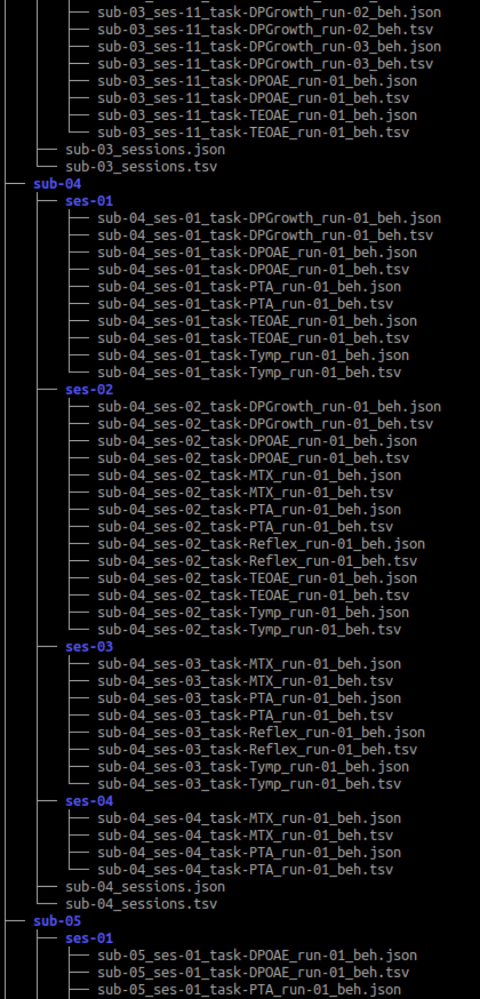
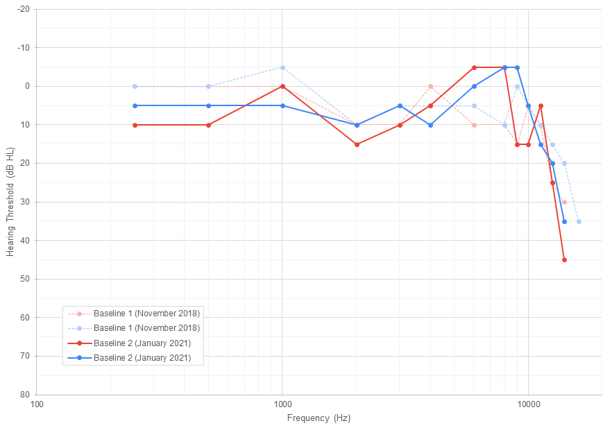
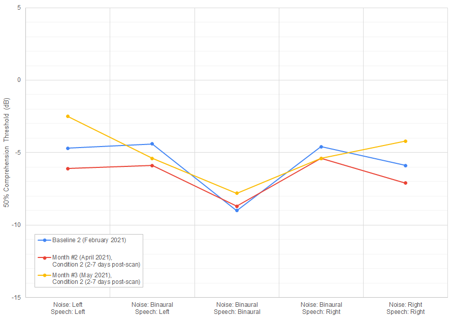

# Auditory-test data management pipeline

Psychology Master's auditory-test data processing project

## Project Definition

### Project background

This data processing pipeline has been developed to be used with the auditory tests data acquired through the Projet Courtois NeuroMod.
This neuroimaging data acquisition project takes place at the Unité de neuroimagerie fonctionnelle (UNF) of the Centre de recherche de l'Institut universitaire de gériatrie de Montréal (CRIUGM).
The Projet Courtois NeuroMod is a longitudinal MRI (functional and anatomical) data acquisition project where participants (6) are scanned on a weekly basis for a period of six years.
One risk associated with intensive protocols like this one is the participants' chronic exposure to high noise levels during the scan sessions.
This is why it is important to regularly monitor their auditory health to ensure that the research protocol is not causing any damage to the participants' hearing.
Part of the project's auditory perception research team job was to administer this monitoring protocol.
To do so, the participants went through different clinical audiology tests every month to keep track of the evolution of their auditory health.
This particular processing pipeline started out as a project for the 2021 edition of BrainHack School.
Following that first development milestone, other functionalities were gradually added to the pipeline.

### Data

The dataset used for this project has been acquired through multiple sessions with each participant between November 2018 and June 2022.
Multiple clinical tests were performed including:
- Otoscopic inspection of the external auditory canal and tympanic membrane
- Tympanometry
- Stapedial reflex test
- Pure-tone audiometry
    - Regular/clinical frequency range (250 Hz - 8 kHz)
    - Extended/Ultra-high frequency range (9 - 20 kHz)
- Matrix speech-in-noise perception test
    - Primary language of the participant: French or English (for all participants)
    - Secondary language of the participant: French or English (for 5 out of the 6 participants)
- Otoacoustic emissions
    - Transiant-evoked otoacoustic emissions (TEOAE)
    - Distortion product otoacoustic emissions (DPOAE) with an L1/L2 ratio of 65/55 dB SPL
    - DPOAE Growth function (DP Growth) for 2 kHz, 4 kHz and 6 kHz

Baseline data were acquired for each of these tests when the participants joined the project (November 2018 - July 2019) and at the beginning of the monitoring protocol (January - February 2021).
Three different combinations of those tests were then designed as experimental conditions and a random sequence of conditions was assigned to each participant.
The specific dataset used in this pipeline includes results from the tympanometry test, the stapedial reflex test, the pure-tone audiometry, the otoacoustic emission tests and the Matrix speech-in-noise perception test.

#### FOR MORE INFORMATION REGARDING THE EXPERIMENTAL PROTOCOL, PLEASE CONSULT THE FOLLOWING PREPRINT:

Fortier, E., Bellec, P., Boyle, J. A., & Fuente, A. (2023). *MRI noise and auditory health: Can one hundred scans be linked to hearing loss?*. PsyArXiv. https://doi.org/10.31234/osf.io/7xkng

### Data formating (BIDS format)

The important amount of data generated by this protocol came in a wide variety of formats.
To be able to manage, process and analyse efficiently that data, an automated processing pipeline was needed.
The first task that needed to be done was to transform each of the differents formats in a common format.
Since the neuroimaging community already has a formating standard (the Brain imaging data structure: BIDS), the best way to be able to include this dataset into the CNeuroMod's already existing BIDS compatible dataset would be to try to adapt the BIDS format to this new kind of data.
To do so, a first python script will take a raw, spreadsheet formated dataset and automatically create a BIDS format database.

#### Exemple of a BIDS compatible file structure reformatting

figure reference:

Gorgolewski, K. J., Auer, T., Calhoun, V. D., Craddock, R. C., Das, S., Duff, E. P., Flandin, G., Ghosh, S. S., Glatard, T., Halchenko, Y. O., Handwerker, D. A., Hanke, M., Keator, D., Li, X., Michael, Z., Maumet, C., Nichols, B. N., Nichols, T. E., Pellman, J., … Poldrack, R. A. (2016). The brain imaging data structure, a format for organizing and describing outputs of neuroimaging experiments. *Scientific data*, *3*, 160044. https://doi.org/10.1038/sdata.2016.44

[](https://www.nature.com/articles/sdata201644)

#### Screen capture of a section of the results obtained with this pipeline



### Graph generation (Pure-tone audiometry, Matrix speech-in-noise perception test and OAE tests)

For some of these tests, such as the pure-tone audiometry test, the data is more easily interpreted when rendered into graphic displays.
The second task to be done is to build python scripts to generate the interactive html graphs using the Plot.ly library.

#### Exemple of audiogram (manually obtained)



#### Exemple of interactive HTML audiogram (obtained with this pipeline)

[](https://mybinder.org/v2/gh/PSY6983-2021/fortier_project/HEAD?filepath=code%2FPTA_sample_figure_generator.ipynb)

#### Exemple of Matrix test results graph (manually obtained)



#### Exemple of Matrix test interactive HTML graph (obtained with this pipeline)

[](https://mybinder.org/v2/gh/PSY6983-2021/fortier_project/HEAD?filepath=code%2FMTX_sample_figure_generator.ipynb)

## Current capabilities

In the current state of this repository, it is possible to find a serie of Python 3 scripts used for different functions of the pipeline.

#### User interface script (master script)

 - main.py ("[repo_root]/"):

#### Virtual environment setup required scripts

 - setup.py ("[repo_root]/"):
 - requirements.txt ("[repo_root]/"):
 - \__init__.py ("[repo_root]/src/"):

#### Multi-purposes script

 - common_functions.py ("[repo_root]/src/"):

#### Data format transformation (BIDS format) scripts

 - BIDS_formater.py: takes as input a spreadsheet containing the tests data and returns .tsv files for each of the tests in a file structure compatible with the BIDS standards.
 - BIDS_utils.py:
 - json_sidecar_generator.py: an early draft of a .json file generator for the BIDS format's metadata files.

#### Graph generation scripts (test results)

 - graph_generator_BIDS.py ("[repo_root]/src/"): a first iteration of a master script to process data and generate interactive graphs (single test and test overview).
 - graph_functions.py ("[repo_root]/src/"): a slave script to be used with graph_generator.py. Contains all the subfunctions that are necessary to plot and save the graphs.
 - graph_DPGrowth_BIDS.py ("[repo_root]/src/"):
 - graph_DPOAE_BIDS.py ("[repo_root]/src/"):
 - graph_MTX_BIDS.py ("[repo_root]/src/"):
 - graph_PTA_BIDS.py ("[repo_root]/src/"):
 - graph_TEOAE_BIDS.py ("[repo_root]/src/"):

#### Test-retest-differences comparison report scripts

 - report_common.py ("[repo_root]/src/"):
 - report_DPGrowth.py ("[repo_root]/src/"):
 - report_DPOAE.py ("[repo_root]/src/"):
 - report_MTX.py ("[repo_root]/src/"):
 - report_PTA.py ("[repo_root]/src/"):
 - report_TEOAE.py ("[repo_root]/src/"):

#### Test-retest-differences graphs generation scripts (in development)

 - graph_delta_DPGrowth.py ("[repo_root]/src/"):
 - graph_delta_DPOAE.py ("[repo_root]/src/"):
 - graph_delta_MTX.py ("[repo_root]/src/"):
 - graph_delta_PTA.py ("[repo_root]/src/"):
 - graph_delta_TEOAE.py ("[repo_root]/src/"):

#### An MRI pure-tone detection task's required file generator (in development)

This functionality is in development and not yet fully functional.
The goal is to generate the design files needed for the pure_tones.py task from the [task_stimuli repository](https://github.com/courtois-neuromod/task_stimuli).
 - MRI_session_design_generator.py ("[repo_root]/src/"):

Two jupyter notebooks are also available to be used in a Binder platform to demonstrate examples of the graph plotting capabilities.

## How to use the AuditoryData_pipeline

### Raw data format

To be able to be processed by this pipeline, data from different types of auditory tests must be regrouped in a spreadsheet ([a Google spreadsheet template is available here](https://docs.google.com/spreadsheets/d/1aKakQJvJnvPUouTUciGm3FMlnNAGIX8NXhulbhjq9d4/edit?usp=sharing): PLEASE START BY MAKING YOUR OWN COPY / DO NOT EDIT THIS TEMPLATE!!!). The pipeline supports the use of a link to a Google spreadsheet (manually input when prompted or stored in the cell right below "test_database" in a .tsv file: "[repo_root]/data/URL.tsv") or the use of an Office Excel spreadsheet file version of the template: "[repo_root]/data/test_database.xlsx". This spreadsheet covers the following tests:
 - Tympanometry
 - Stapedial reflex test
 - Pure-tone audiometry
     - Regular/clinical frequency range (250 and 500 Hz, 1, 2, 3, 4, 6 and 8 kHz)
     - Extended/Ultra-high frequency range (9, 10, 11.2, 12.5, 14, 16, 18 and 20 kHz)
 - Matrix speech-in-noise perception test
     - Primary language (French or English)
     - Secondary language (French or English)
     - Conditions:
         - Practice sequence (Stimulus: bilateral, Noise: bilateral)
         - Sequence #1 (Stimulus: bilateral, Noise: bilateral)
         - Sequence #2 (Stimulus: left, Noise: bilateral)
         - Sequence #3 (Stimulus: right, Noise: bilateral)
         - Sequence #4 (Stimulus: left, Noise: left)
         - Sequence #5 (Stimulus: right, Noise: right)

The OAE test (TEOAE, DPOAE and DPOAE growth function) results must be exported as .csv files from the acquisition software (i.e., ILOv6) and saved in the "[repo_root]/data/auditory_tests/OAE/" folder. Each file name should include the following informations (separated by underscores):
 - The participant's ID: sub-XX (01 to 06)
 - The test date and condition:
     - Baseline: YYYY-MM-DD-Baseline
     - Pre-scan condition: YYYY-MM-DD-PreScan
     - Post-scan condition: YYYY-MM-DD-PostScan
     - Delayed condition: YYYY-MM-DD-2POST
 - The type of test:
     - TEOAE: TE
     - DPOAE: DPOAE6555
     - DPOAE Growth function: DPGrowth-X000 (2000, 4000 or 6000)
 - The tested ear:
     - Left ear: L
     - Right ear: R
 - Finish with the file extension: .csv

**The overall filename should look like this: *sub-01_1900-01-01-Baseline_DPOAE_L.csv*.**

### Required Python libraries

In addition to Python 3, several free libraries are necessary for the pipeline to work.
You will need the following libraries (and their dependencies):
 - colorama
 - matplotlib
 - notebook
 - numpy
 - pandas
 - plotly
 - seaborn
 - scikit-learn

If needed, a virtual environment setup procedure including all the required libraries is available in the next section.

### Virtual environment

#### Initial setup

To create a Python virtual environment already equiped with all the necessary libraries, follow these steps:
 1. Open your terminal
 2. Navigate to the AuditoryData_pipeline folder
 3. At the root of the AuditoryData_pipeline folder, copy/paste the following code line in your terminal (don't forget to insert the name of your environment), then press enter

```
$ python3 -m venv [name of your new virtual environment folder]
```

Your terminal should now install the virtual environment.
When the process is done, a new folder named in accord with what you specified in the command should have been created at the root of your AuditoryData_pipeline folder.

#### Environment activation and deactivation

To activate your Python virtual environment, follow these steps:
 1. Open your terminal
 2. Navigate to the AuditoryData_pipeline folder
 3. At the root of the AuditoryData_pipeline folder, copy/paste the following code line in your terminal (don't forget to insert the name of your environment), then press enter

```
$ source [name of the virtual environment folder]/bin/activate
```

Your virtual environment should now be activated (the name of your environment should now show between parenthesis in front of the name of your system's name in the terminal command line).

To deactivate your virtual environment, simply input the following command and press enter

```
$ deactivate
```

### Library and pipeline software installation

In order to run the pipeline, you will now have to install the dependencies and the pipeline's local package (in your virtual environment or your entire computer according to your needs).
To do so, you will first need to copy/paste the following code line at the root of the AuditoryData_pipeline folder to install the dependencies and press enter

```
$ pip install -r requirements.txt
```

The second step will be to install the AuditoryData_pipeline software.
You will need to copy/paste the following code line at the root of the AuditoryData_pipeline folder and press enter

```
$ pip install .
```

It will run the setup.py script and install the AuditoryData_pipeline as a local package.

### Run the AuditoryData_pipeline

To run the software, simply navigate to the root of your repository, input the following command and press enter

```
$ python AuditoryData_pipeline.py
```

You will see the pipeline's main menu appear and will be able to choose which functionality you wish to use.

## About the pipeline creators

<table>
  <tr>
    <td align="center">
      <a href="https://github.com/eddyfortier">
        
        <br /><sub><b>E. Fortier</b></sub>
      </a>
      <br />
    </td>
    <td align="center">
      <a href="https://github.com/lilielkhalil">
        
        <br /><sub><b>Lili El Khalil</b></sub>
      </a>
      <br />
    </td>
  </tr>
</table>

### E. Fortier's bio

While working on the development of this processing pipeline, Mr. Fortier was a Master student in Psychology at Université de Montréal.
He was also part of the auditory perception and protection branch of the Projet Courtois NeuroMod (Centre de recherche de l'Institut universitaire de gériatrie de Montréal).
Before that, he did undergraduate studies in Music writing (B. Mus.) and in Cognitive neuroscience (B. Sc.).
Having backgrounds in both of these fields, his research interests include auditory perception, music perception and creation, and noise pollution's effects on perception and health (physical and mental).

### Lili El Khalil's personal Backgroung

Ms. El Khalil is a Master student in Psychology at Université de Montréal.
She is a research assistant with Marie Audrey Lavoie in the visual neurocognition laboratory.
She helped to jumpstart the pipeline's development during her time as a participant at the 2021 BrainHack School.

## Conclusion

This project includes:
- a README.md file presenting the project
- a LICENSE file
- a requirements.txt file to be used by a Binder platform to run Jupyter Notebooks
- python scripts to generate interactive graph figures
- two Jupyter Notebooks to be loaded using a Binder platform
- python scripts to create and format a BIDS compatible dataset from the original dataset's spreadsheet format and .csv files
- a python script to create .json metadata files
- images and html sample figures to be displayed by the README.md file

We would like to thank the BrainHack School 2021 team of mentors for their availability and their help on this journey.
We would also like to thank the members of the SIMEXP lab and Courtois NeuroMod project team for the occasional coding advices.
Finally, we would like to thank the Courtois NeuroMod project's participants for their time.
