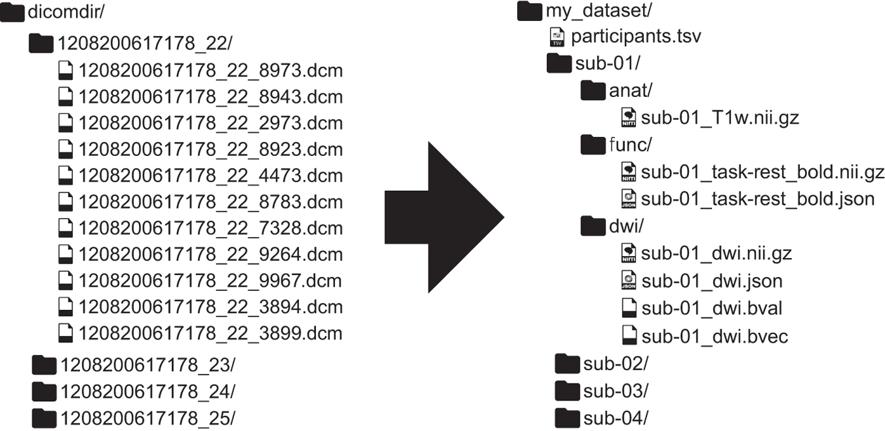
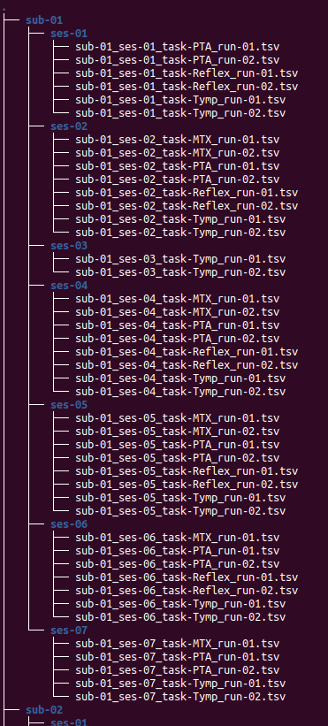

# Auditory test data management pipeline project

Psychology Master's data processing project

<table>
  <tr>
    <td align="center">
      <a href="https://github.com/eddyfortier">
        
         <b>E. Fortier</b>
      </a>
       
    </td>
    <td align="center">
      <a href="https://github.com/lilielkhalil">
        
         <b>Lili El Khalil</b>
      </a>
       
    </td>
  </tr>
</table>

## E. Fortier's bio

Mr. Fortier is a Master student in Psychology at Université de Montréal.
Before that, he did a first Bachelor degree in Music writing (B. Mus.) and a second Bachelor degree in Cognitive neuroscience (B. Sc.).
Having backgrounds in both of these fields, his research interests include auditory perception, music perception and creation, and noise pollution's effects on perception and health (physical and mental>
He is currently part of the auditory perception and protection branch of the Projet Courtois NeuroMod (Centre de recherche de l'Institut universitaire de gériatrie de Montréal).

## Lili El Khalil's personal Backgroung

Lili El Khalil is a Master student in Psychology at Université de Montréal.
She is a research assistant with Marie Audrey Lavoie in the visual neurocognition laboratory.

## Project Definition

## Project background

This data processing pipeline is being developed to be used with the auditory tests data acquired through the Projet Courtois NeuroMod.
This neuroimaging data acquisition project takes place at the Unité de neuroimagerie fonctionnelle (UNF) of the Centre de recherche de l'Institut universitaire de gériatrie de Montréal (CRIUGM).
The Projet Courtois NeuroMod is a longitudinal fMRI data acquisition project where participants get scanned almost every week.
One risk associated with intensive protocols like this one is the chronic exposure of the participants to high noise levels during the scan sessions.
This is why it is important to regularly monitor their auditory health to ensure that the research protocol is not causing any damage to the participants' hearing.
Part of the auditory perception team's job is to do this monitoring task.
To do so, the participants go through different clinical tests every month to keep track of the evolution of their auditory health.

## Data

The dataset used for this project has been acquired through multiple sessions with each participant since November 2018.
Multiple clinical tests are performed including:
- Otoscopic inspection of the external auditory canal and tympanic membrane
- Tympanometry
- Stapedial reflex test
- Pure-tone audiometry
    - Regular clinical frequencies range (from 250 Hz to 8 kHz)
    - Ultra-high frequencies extended range (from 9 kHz to 20 kHz)
- Matrix speech-in-noise perception test
    - In the primary language of the participant: French or English (for all participants)
    - In the second language of the participant: French or English (for 5 out of the 6 participants)
- Otoacoustic emissions
    - Transitory evoked otoacoustic emissions (TEOAE)
    - Distortion product otoacoustic emissions (DPOAE) with a L1/L2 ratio of 65/55 dB SPL
    - Growth function (DP Growth) with 2 kHz, 4 kHz and 6 kHz

Baselines were acquired for each of these tests when the participants joined the project.
Three different combinations of those tests were then designed as experimental conditions and randomly assigned to each of the participant in a way that they will all do each of those conditions four times over the course of a twelve months protocol.
The specific dataset used so far in this pipeline includes results from the tympanometry, the stapedial reflex test, the pure-tone audiometry and the Matrix speech-in-noise perception test.

## Data formating (BIDS format)

Such an important amount of data coming from a wide variety of auditory tests and presented in different formats means that a processing pipeline might be needed to be able reformat, classify and produce figures from it.
The first task that needs to be done concerns the dataset formatting.
Since the neuroimaging community already has a formating standard, the Brain imaging data structure (BIDS), the best way to be able to include this dataset into an already existing BIDS compatible dataset would be to try to adapt the BIDS format to this new kind of data.
To do so, a first python script will take a raw, spreadsheet formated dataset and automatically create a BIDS format database.

### Exemple of a BIDS compatible file structure reformatting

figure reference:

Gorgolewski, K. J., Auer, T., Calhoun, V. D., Craddock, R. C., Das, S., Duff, E. P., Flandin, G., Ghosh, S. S., Glatard, T., Halchenko, Y. O., Handwerker, D. A., Hanke, M., Keator, D., Li, X., Michael, Z., Maumet, C., Nichols, B. N., Nichols, T. E., Pellman, J., … Poldrack, R. A. (2016). The brain imaging data structure, a format for organizing and describing outputs of neuroimaging experiments. Scientific data, 3, 160044. https://doi.org/10.1038/sdata.2016.44

### Screen capture of a section of the results obtained with this pipeline

## Graph generation (Pure-tone audiometry, Matrix speech-in-noise perception test)

For some of these tests, such as the pure-tone audiometry test, the data is more easily interpreted when rendered into graphic displays.
The second task to be done is to build python scripts to generate the interactive html graphs using the Plot.ly library.

### Exemple of audiogram

### Exemple of Matrix test results graph

.png)

## Data

The dataset used for this project was acquired through multiple sessions with each participant between November 2018 and August 2021.
Multiple clinical tests were performed including:
- Otoscopic inspection of the external auditory canal and tympanic membrane
- Tympanometry
- Stapedial reflex test
- Pure-tone audiometry
    - Regular clinical frequencies range (from 250 Hz to 8 kHz)
    - Ultra-high frequencies extended range (from 9 kHz to 20 kHz)
- Matrix speech-in-noise perception test
    - In the primary language of the participant: French or English (for all participants)
    - In the second language of the participant: French or English (for 5 out of the 6 participants)
- Otoacoustic emissions
    - Transitory evoked otoacoustic emissions (TEOAE)
    - Distortion product otoacoustic emissions (DPOAE) with a L1/L2 ratio of 65/55 dB SPL
    - Growth function (DP Growth) with 2 kHz, 4 kHz and 6 kHz

Baselines were acquired for each of these tests.
Three different combinations of those tests were then designed as experimental conditions and randomly assigned to each of the participant in a way that they will all do each of those conditions four times over the course of a twelve months protocol.
The specific dataset used for this project includes results from the tympanometry, the stapedial reflex test, the pure-tone audiometry and the Matrix speech-in-noise perception test.

In the current state of this repository, it is possible to find a serie of Python 3 scripts:
 - add_SNR_OAEs.py: an early draft of a script to reformat and add missing informations in the OAE tests .csv files.
 - BIDS_formater.py: takes as input a spreadsheet containing the tests data and returns .tsv files for each of the tests in a file structure compatible with the BIDS standards.
 - json_sidecar_generator.py: an early draft of a .json file generator for the BIDS format's metadata files.
 - graph_generator.py: a first iteration of a master script to process data and generate interactive graphs (single test and test overview).
 - other_functions.py: a slave script to be used with graph_generator.py. Contains all the subfunctions that are necessary to plot and save the graphs.

Two jupyter notebooks are also available to be used in a Binder platform to demonstrate examples of the graph plotting capabilities.

### Exemple of interactive HTML audiogram

### Exemple of Matrix test interactive HTML graph

## Conclusion

This project includes:
- a README.md file presenting the project
- a LICENSE file
- a requirements.txt file to be used by a Binder platform to run Jupyter Notebooks
- two python scripts to generate interactive graph figures
- two Jupyter Notebooks to be loaded using a Binder platform
- a python to create and format a BIDS compatible dataset from the original dataset's spreadsheet format
- a python script to edit and save OAE tests .csv files
- a python script to create .json metadata files
- images and html sample figures to be displayed by the README.md file

We would like to thank the BrainHack School 2021 team of mentors for their availability and their help on this journey.
We would also like to thank the Projet Courtois NeuroMod participants for their time.
